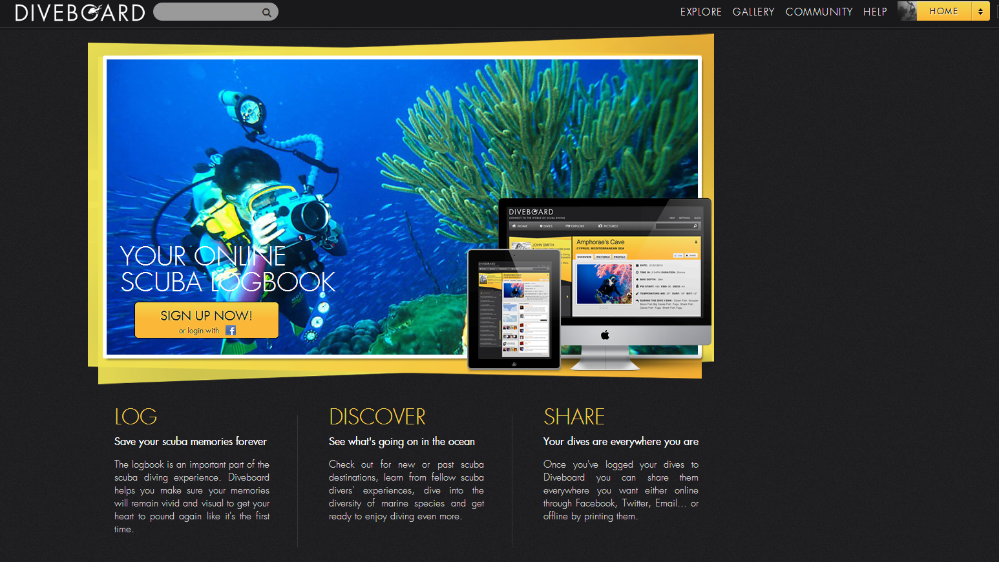
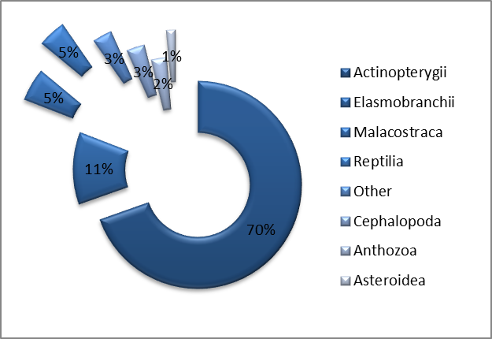
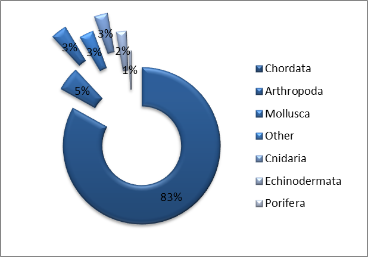
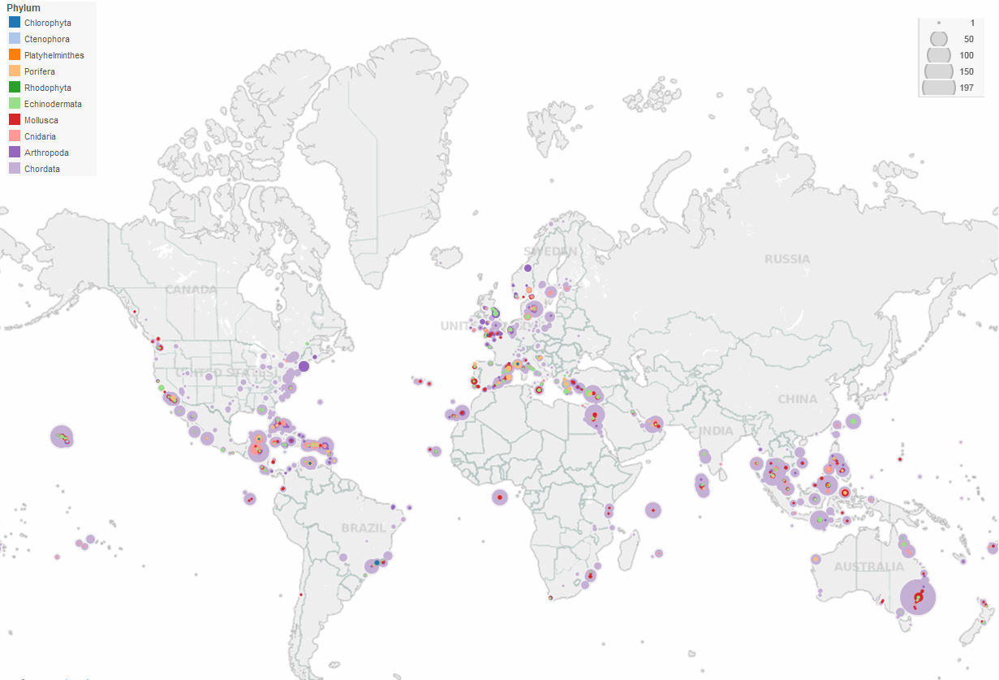
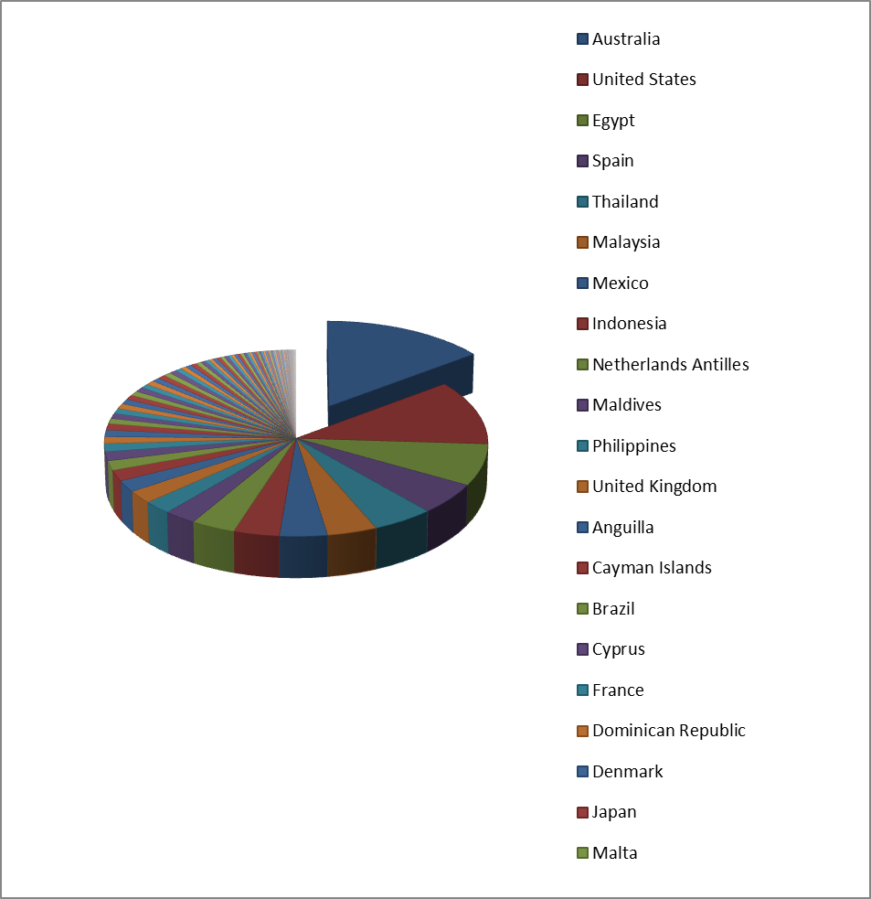
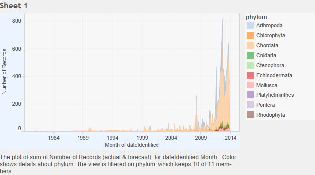
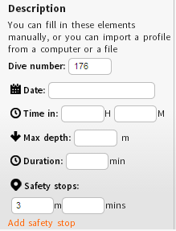
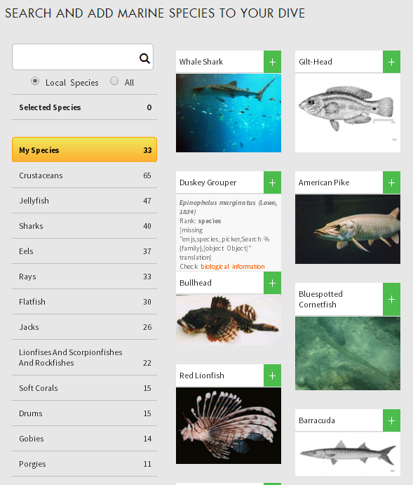
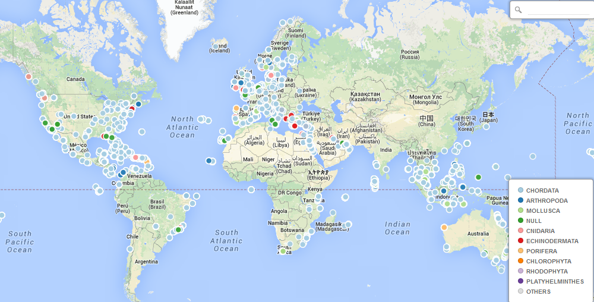
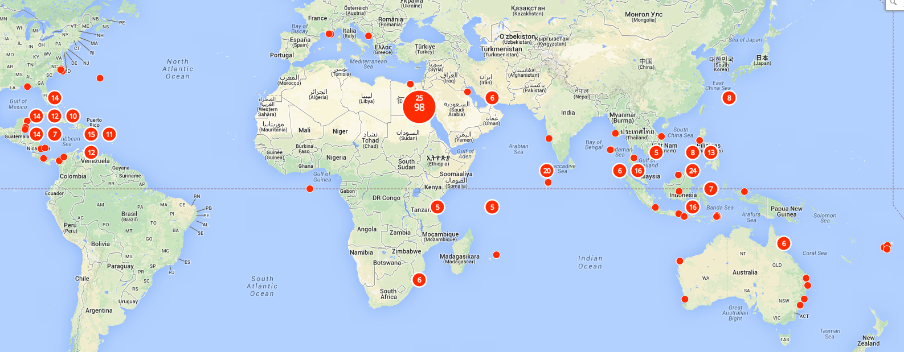

# Diveboard - Scuba diving citizen science observations

Dimitri Brosens[^2],[^3], Peter Desmet[^2],[^3], Alexander Casassovici[^1]

[^1]: Diveboard SARL, Neuilly-sur-Seine, France

[^2]: Datafable, Brussels, Belgium

[^3]: Research Institute for Nature and Forest, Brussels, Belgium

**Corresponding author(s)**: Alexander Casassovici (alex@diveboard.com), Dimitri Brosens (Dimitri.Brosens@inbo.be)

---

Received {date} | Revised {date} | Accepted {date} | Published {date}

---

**Citation**: Combination of authors, year of data paper publication (in parentheses), Title, Journal Name, Volume, Issue number (in parentheses), and doi of the data paper.

---

**Resource citation**: Diveboard - Scuba diving citizen science observations. Online at [http://www.diveboard.com](http://www.diveboard.com)
and [http://ipt.diveboard.com/resource.do?r=diveboard-occurrences](http://ipt.diveboard.com/resource.do?r=diveboard-occurrences). 

## Abstract

Diveboard ([http://www.diveboard.com](http://www.diveboard.com)) is an online scuba diving platform, where divers can digitize or log their dives by assembling exhaustively metadata created during a scuba dive. Such data can include include temporal and geographical data along with additional content such as dive profiles, observed species lists or pictures and videos. Though logging, scuba divers participate in citizen science surveys and projects, and interact with others. More than 300,000 contents have already been created on Diveboard and the community is growing exponentially. This dataset contains all observations made by Diveboarders worldwide who have not opt-out on the citizen science program and the species in this dataset are linked to the Encyclopedia of Life (www.eol.org) as a taxonomical backbone. The dataset contains mainly fish observations (Actinopterygii and Elasmobranchii) (73%) but also holds occurrences of numerous other groups. Every record in the dataset links back to the digital dive log, creating the opportunity to trace back to the original observation and dive, through the Diveboard website. For many dives pictures are provided in the digital logbook, but momentarily they are not directly linked with the occurrence data. To date the dataset contains around 16 000 occurrences provided by 800 divers, recorded on 2500 different localities in 106 different countries. The number of participating divers is growing every day and the amount of data which could be generated through Diveboard is virtually unlimited. The “Diveboard; Citizen science” dataset is automatically published every month through and is available through: [http://ipt.diveboard.com/resource.do?r=diveboard-occurrences](http://ipt.diveboard.com/resource.do?r=diveboard-occurrences)
Issues with the data or the dataset can be submitted through github: [https://github.com/Datafable/diveboard-data-paper](https://github.com/Datafable/diveboard-data-paper)

*Figure 1: the homepage of www.diveboard.com*

**Keywords**: occurrence, observation, citizen science, marine, freshwater, fishes, scuba diving, reef, shark

**Purpose**: The Diveboard dataset has been created by the desire of the amateur diver community to help the scientific community in research towards protecting the biodiversity of our oceans, seas, and freshwater bodies. The data is not generated with any overarching purpose, other than completing one’s personal digital log of dives. The Diveboard community has dedicated the data to the public domain under a Creative Commons Zero waiver, so these can be used as widely as possible. It needs to be mentioned that this dataset originated from citizen science observations and no direct validation by experts was performed. The Diveboard team and Datafable are continuously working on ways to improve the quality and fitness for use of the data. Just like the Diveboard website, the diveboard dataset is a continious work in progress and we predict major quality improvement and better identifications in the data. A featured feature on the website is that species can be identified by amateurs or specialists based on the pictures taken during a certain dive.

**Data published through GBIF**: [http://ipt.diveboard.com/resource.do?r=diveboard-occurrences](http://ipt.diveboard.com/resource.do?r=diveboard-occurrences)

## Taxonomic coverage

**General taxonomic coverage description**: The dataset covers animals (and very few plants) observed during scuba dives performed by members of the Diveboard community. To date 2013-11-28, about 73 % of the recorded specimens are fishes from the classes Elasmobranchii (12%) and  Actinopterygii (72%) other well represented classes are the Malacostraca (5%), Reptilia (5%) (mostly Testudines) and Cephalopoda (3%). Overall, 29 different classes, according to Encyclopedia of life are so far recorded in the database.  For about 490 occurrences representing 167 species and 9 classes, no higher taxonomy was automatically retrieved from the Encyclopedia of life. Meaning that in the dataset, no higher taxonomy was given for these 490 records. In the metadata these extra classes were recorded, see section taxonomic ranks.

Diveboarders can log their dives online, including the species they observed, by using the Encyclopedia of Life ([http://eol.org](http://eol.org)) as a checklist. Most of the observations are identified to species level (to date about 14.700), though some caution regarding the identifications is appropriate. When searching for a species, the diver is given the opportunity to browse the speices ancestry and select higher taxonomic rank if unsure of the precise species. In case of doubt, the observer/identifier can be contacted via the references field, which references his/her Diveboard profile or through this Github link: [https://github.com/Datafable/diveboard-data-paper](https://github.com/Datafable/diveboard-data-paper)

 

*Figure 2a: Taxonomic coverage of the Diveboard dataset, Classes*

*Figure 2b: Taxonomic coverage of the Diveboard datset, Phyla*

### Taxonomic ranks

**Kingdom**: Animalia, Plantae

**Phylum**: Annelida, Porifera, Platyhelminthes, Cnidaria, Ctenophora, Mollusca, Arthropoda, Echinodermata, Chordata, Rhodophyta, Chlorophyta, Echiura, Heterokontophyta, Magnoliaphyta, Ochrophyta, Sipuncula

**Class**: Actinopterygii, Anthozoa, Ascidiacea, Asteroidea, Aves, Bivalvia, Branchiopoda, Bryopsidophyceae, Calcarea, Cephalopoda, Crinoidea, Cubozoa, Demospongiae, Echinoidea, Elasmobranchii, Florideophyceae, Gastropoda, Hexactinellida, Holocephali, Holothuroidea, Hydrozoa, Liliopsida, Magnoliopsida, Malacostraca, Mammalia, Maxillopoda, Merostomata, Ophiuroidea, Phaeophyceae, Polychaeta, Pycnogonida, Reptilia, Rhabditophora, Scyphozoa, Sipunculidea, Tentaculata, Thaliacea, Ulvophyceae

*Figure 3: Spacial and taxonomical coverage of the most frequent occurring classes combined, using Tableau public*

**Common names**: ray-finned fishes, sharks, rays & skates, crustaceans, echinoderms...

## Spatial coverage

**General spatial coverage**: The Diveboard Scuba diving citizen science observations dataset is a global dataset. This means that observations can “virtually” be made everywhere on the planet. Of course, divers do mostly explore more or less fixed dive spots. When logging a dive on diveboard, divers do always have the opportunity to create a new “locality or dive site”, by naming it and placing a pin on the map. The person who logs the dive, is also asked to give the country (Dwc: country); the location (nearest administrative area); the sea/lake name (DwC:WaterBody) and the longitude (decimalLongitude) and latitude (decimalLatitude). More likely, a diver can log a dive to an already know dive site in the Diveboard database. In the dataset we can find, to date, data originating from 106 countries. Logically, and representesd in the data are top diving countries like Australia (Great barrier reef; almost 3000 occurrences, United states (mainly Pacific ocean; almost 2000 occurrences) and Egypt (Red sea; almost 1200 occurrences).

**Coordinates**: 90°0'0''S and 90°0'0''N Latitude; 180°0'0''W and 180°0'0''E Longitude 

*Figure 4: 106 different coutries occur in the dataset. This figure only gives the top 21 countries*

## Temporal coverage

*Figure 5: The number of recorded occurrences through time. Since the Diveboard application is online, a significant increase of the data appeared and around 1000 of new recordings are added every month.*

**Living time period**: 1980-recent

## Methods

**Method step description**: Event and location conditions (date, time, depth, etc.) are often logged automatically by the dive computer or recorded in the divers personal log. This data can be imported automatically or manually added by the diver in the Diveboard application. Observed species are always added manually, by choosing the right species from the checklist. If the observed species is not available on Diveboard, you can import the species by using a protocol developed by diveboard which build on the EOL webservices. These actions can be done just after surfacing, as the Diveboard application is available online and as a mobile app, which allows divers to record their dive even if no internet connection is available. Older data can be copied into the application manually by transcripting the original divers log.

*Figure 6: Certain variables can be imported manually or by computer*

*Figure 7: Observed species are imported by selecting the observed species in the EOL checklist* 

**Study extent description**: The dataset covers recorded observations made during scuba dives performed by members of the Diveboard community. As such there is no specific geographic or temporal study extent, although most dives logged on Diveboard were conducted in well-known dive spots, such as well-known reefs and wrecks. In a later phase, specific surveys might also be logged on Diveboard.

**Sampling description**: Observations are not recorded with a specific goal in mind and only reflect what the diver has noticed during his dive. Divers rarely conduct a full inventory of a dive spot, so the observed species only represent part of the occurring species at the time of the dive. There is a sampling bias for known, interesting, noticeable and/or rare species. The power in this dataset is the virtual unlimited amount of recorders and occurrences that will be published on GBIF. Every month, since the first publication of the dataset, around thousand occurrences were published.

**Quality control description**: The Diveboard application restricts divers to only record species found in the Encyclopedia of Life ([http://eol.org](http://eol.org)). As such, all observations are linked to an EOL page in the field taxonID. It is important to note that the data are not validated by specialists. More validation methods will appear in the near future. To date, there is the possibility to contact every diver about a specific occurrence through the application for corrections. Later, recording species based on published photographs by specialists or other citizen scientists will be a possibility.  

## Datasets

## Dataset history

Since 2011, Diveboard lets scuba divers track and share their scuba diving experiences by providing them with a multimedia online logbook. The logbook can connect directly with dive computers through a PC/MAC/Linux plugin and fetch dive profiles. Divers can complete their logbook by adding observed species for every performed dive. Since October 2013, this online logbook is connected with GBIF, hoping that the publication of the data will help more scuba divers get involved in monitoring our biotope in real time and in providing valuable data to scientists including species occurrences and dive profiles. Not only recent succeeded dives can be logged on Diveboard, also older dives, including occurrences, logged in the original divers log booklet can be digitized in the same way. This means that Diveboard is not only generating new data, but also historical data is mobilized this way.

##Proof of concept

Working with citizen science data is for many scientists a very tricky business. But many studies indicate that the quality of data generated by voluntears differ little from data generated from professionals (Crall et al., 2011) Especially, when given proper training and materials, volunteers can collect data comparable to data collected by professional scientists (Au et al., 2000; Canfield et al. 2002; Fore et al., 2001; Delaney et al., 2008). Also, citizens scientists who feel they are making contributions to the scientific study return higher quality data (Nerbonne & Nelson, 2008). The community of divers around the world is off course very diverse and labeling all amateur divers citizen scientists would be a little out of line. But, divers do have the obligation to log their dives in a logbook. The main reasons herefore are insurance policies and having a countersigned record of your dives for later training and off course it's a journal of your personal diving adventures. Further, divers have a tradition in marking the most interesting observations in their logbook. The signature of the buddy diver or the stamp of the diving centre will, in a way, validate the sightings done during the dive.
The idea of publishing a 100% diver community generated dataset on GBIF,in the hope to provide usefull data to the scientific community supported by the Invasive lionfish case.

###The Lionfish case

The data published through Diveboard already contribute valuable information to users of the GBIF portal. For example, they help show the spread of the highly invasive Lionfish (Pterois spp), native to the Indo-Pacific region and now causing major problems in Caribbean and western Atlantic coral reefs ([http://www.gbif.org/page/2991](http://www.gbif.org/page/2991)).

We succeeded in visualising the invasive path of the Lionfish in those areas by using Cartodb, a tool to visualize geospatial data in combination with the Diveboard dataset. The dataset, which has been published throught the Diveboard IPT (http://ipt.diveboard.com/resource.do?r=diveboard-occurrences) on GBIF ([http://www.gbif.org/dataset/66f6192f-6cc0-45fd-a2d1-e76f5ae3eab2](http://www.gbif.org/dataset/66f6192f-6cc0-45fd-a2d1-e76f5ae3eab2)) was downloaded and imported integrally in the tool. 
CartoDB can recognize geographical and shows all the data immediately on the map ([http://cdb.io/1g4xamr](http://cdb.io/1g4xamr)). 

*Figure 8: All the occurrence Diveboard data projected on the Worldmap using CartoDB*

The CartoDB querying tool was used to filter the data for occurrences for the taxon *Pterois* by using this simple query.

SELECT * FROM Diveboard_occurrences 
WHERE scientificName LIKE '%Pterois%'

*Figure 9: All the occurrences of the Genus Pterois are visualized on this map*

This query would show all the *Pterois sp.* occurrences in the dataset on the worldmap (http://cdb.io/1g4xD86). Figure 9 shows all the occurrences of the Genus level *Pterois*. For rendering the data through time we used another option, which was recently created by the CartoDB team, the Torque tool. We simply had to indicate in CartoDB which column in the dataset provided the timestamp (using ISO standard) of the occurrence to get this to work. The result is a worldmap where the occurrences of *Pterios* are visualized over time. This work is visible online through this url: [http://cdb.io/1n2nEKm](http://cdb.io/1n2nKm)

When we add the data which was already published on the GBIF network we see a rather complete image of the Lionfish invasion in the Carribean and Western atlantic coral reefds through this link: http://cdb.io/1g4zFFg. The occurrences between 1824 and 2009 originate from aprox. 85 different datasets, while more than 66 % of the occurrences of the genus *Pterois*done since 2010 are related to the Diveboard dataset. 

## Featured data use

The data generated through Diveboard has a high potential in the monitoring of reef biodiversity. Unfortunately data generated by divers is biased. Divers usually only note the most interesting observed species and species are not always completely determined. For this dataset 87% of the occurrences are brought to species level. In the dataset there is a large percentage of Actinopterygii (70%) and Elasmobranchii (10%) recorded, simply because divers usually look for the “big” fish or everything out of the ordinary. On the other hand, the data is very valuable and can potentially work as an early warning system for invasive species. The invasion of the Lionfish (Pterois sp.) in the seas near Central America is well illustrated through in data. 

## Dataset description 

The Diveboard Darwin Core Archive is generated by creating a custom SQL query on the original Diveboard MySQL database. The SQL query generates a particular view on the data which is compliant with the Darwin Core standard. In IPT, a simple SQL statement makes the view ready for publication. After validation of the mapping the Darwin Core Archive is created and published to GBIF. More information on this process can be found at: [https://github.com/Datafable/diveboard-gbif](https://github.com/Datafable/diveboard-gbif). The Darwin Core terms published in this dataset are:

id, type, modified, language, rights, rightsHolder, references, datasetID, institutionCode, collectionCode, datasetName,	 ownerInstitutionCode, basisOfRecord, catalogNumber, recordedBy, associatedMedia, eventID, samplingProtocol, eventDate, habitat, fieldNotes, EventRemarks	waterBody, country,	countryCode,	locality	verbatimLocality, minimumElevationInMeters, maximumElevationInMeters,	minimumDepthInMeters, maximumDepthInMeters, locationRemarks,	decimalLatitude, decimalLongitude, geodeticDatum, coordinateUncertaintyInMeters, georeferenceSources, identifiedBy, dateIdentified, taxonID, scientificName, nameAccordingTo, kingdom, phylum, class, order, family,	genus and taxonRank

* **Object name**: Darwin Core Archive Diveboard - Scuba diving citizen science observations
* **Character encoding**: UTF-8
* **Format name**: Darwin Core Archive format
* **Format version**: 1.0
* **Distribution**: [http://ipt.diveboard.com/archive.do?r=diveboard-occurrences](http://ipt.diveboard.com/archive.do?r=diveboard-occurrences)
* **Publication date of data**: 2013-11-04
* **Language**: English
* **Licenses of use**: [http://creativecommons.org/publicdomain/zero/1.0/](http://creativecommons.org/publicdomain/zero/1.0/)
* **Norms for data use and publication**:

The data published on ipt.diveboard.com is published under a CC0 waiver. This means that the data is free to use. Of course we would like you to take this in consideration:

Based on [http://www.canadensys.net/norms](http://www.canadensys.net/norms)

*Give credit where credit is due*: As is common practice in scientific research, cite the data you are using.

*Be responsible*: Use the data responsibly. The data are published to allow anyone to better study and understand the world around us, so please do not use the data in any way that is unlawful, harmful or misleading. Understand that the data are subject to change, errors and sampling bias. Protect the reputation of the data publisher and clearly indicate any changes you may have made to the data.

*Share knowledge*: Let us know if you have used the data and inform the data publisher(s) if you have comments about the data, notice errors, or want more information.

*Respect the data waiver*: Understand and respect the data license or waiver under which the data are published. It is indicated in the rights field of every record and in the dataset metadata.

* **Object name**: GBIF data portal
* **Character encoding**: UTF-8
* **Format name**: various formats
* **Distribution**: [http://www.gbif.org/dataset/66f6192f-6cc0-45fd-a2d1-e76f5ae3eab2](http://www.gbif.org/dataset/66f6192f-6cc0-45fd-a2d1-e76f5ae3eab2)
* **Metadata language**: English
* **Date of metadata creation**: 2013-09-25
* **Hierarchy level**: Dataset

**Additional information**: The data is collected with the help of divers all around the world. If you have questions regarding surveying specific dive sites, you can contact us at support@diveboard.com and we will see what we can do. The dataset was standardized, documented and published with the help of Datafable, a team of open data volunteers. The process is documented here: [https://github.com/Datafable/diveboard-gbif](https://github.com/Datafable/diveboard-gbif).

## Acknowledgments

We would like to thank the Global Diveboard community, without divers there is no Diveboard and definitely no Diveboard datset.

## References

Encyclopedia of Life. Available from [http://www.eol.org](http://www.eol.org). Accessed continuously from 2011
